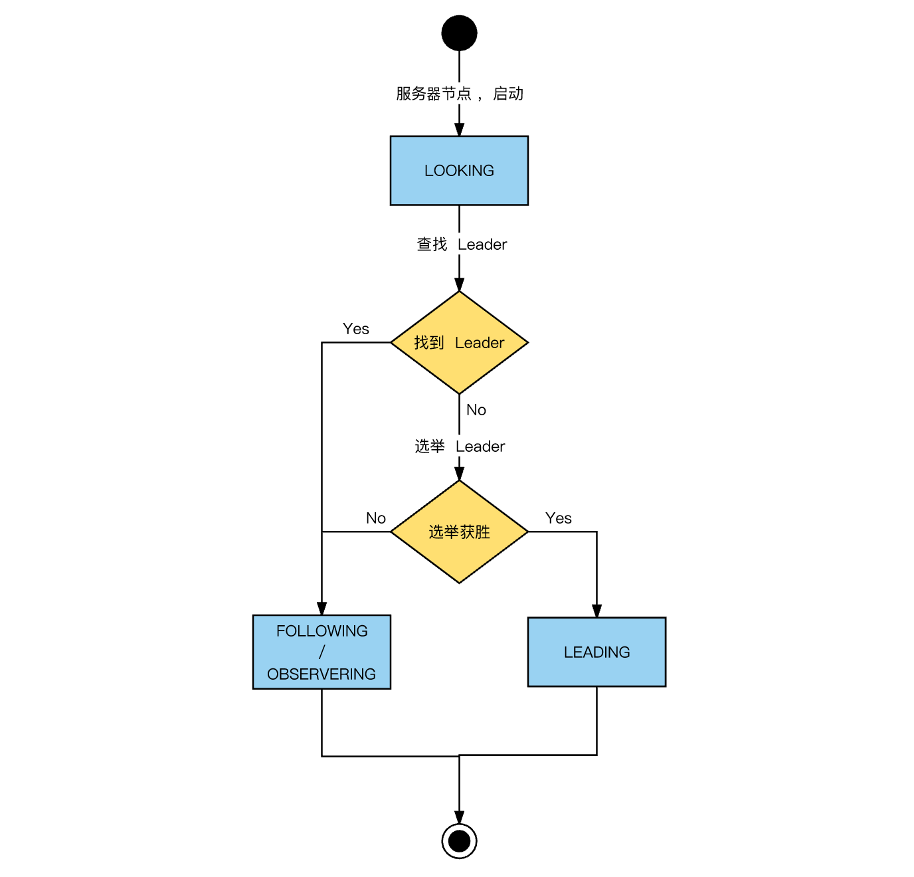
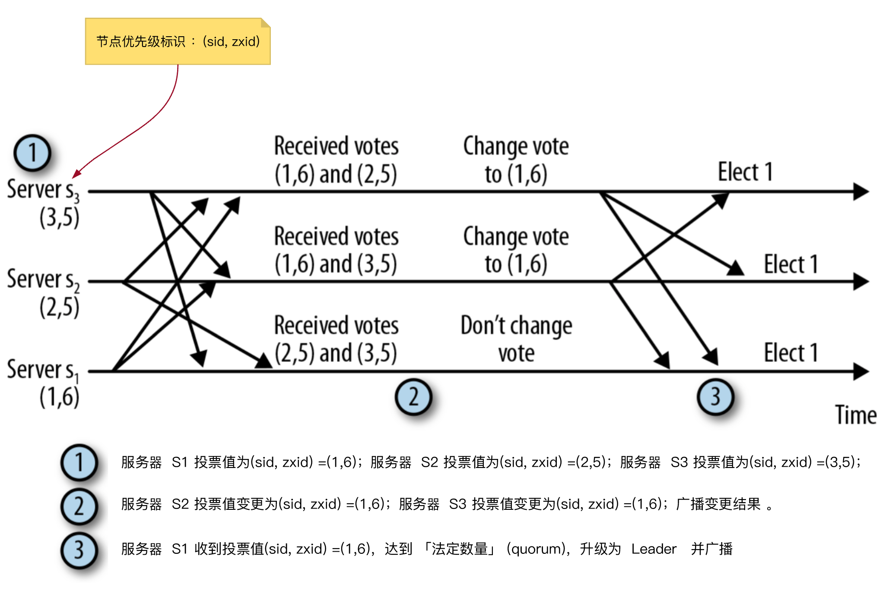

# [Zookeeper](https://draveness.me/zookeeper-chubby)

> ZK 不是解决分布式问题的银弹

## 分布式应用

分布式应用可以在给定时间（同时）在网络中的多个系统上运行，通过协调它们以快速有效的方式完成特定任务。通常来说，**对于复杂而耗时的任务，非分布式应用（运行在单个系统中）需要几个小时才能完成，而分布式应用通过使用所有系统涉及的计算能力可以在几分钟内完成**。

通过将分布式应用配置为在更多系统上运行，可以进一步减少完成任务的时间。分布式应用正在运行的一组系统称为 **集群**，而在集群中运行的每台机器被称为 **节点**。

### 分布式应用的优点

  - 可靠性：单个或几个系统的故障不会使整个系统出现故障。
  - 可扩展性：可以在需要时增加性能，通过添加更多机器，在应用程序配置中进行微小的更改，而不会有停机时间。
  - 透明性：隐藏系统的复杂性，并将其显示为单个实体/应用程序。

### 分布式应用的挑战

  - 竞争条件：两个或多个机器尝试执行特定任务，实际上只需在任意给定时间由单个机器完成。例如，共享资源只能在任意给定时间由单个机器修改。
  - 死锁：两个或多个操作等待彼此无限期完成。
  - 不一致：数据的部分失败。

## ZooKeeper基础

Apache ZooKeeper是由集群（节点组）使用的一种服务，用于在自身之间协调，并通过稳健的同步技术维护共享数据。ZooKeeper本身是一个分布式应用程序，为写入分布式应用程序提供服务。

ZooKeeper 的好处：

  - 简单的分布式协调过程
  - 同步：服务器进程之间的相互排斥和协作。
  - 有序性
  - 序列化：根据特定规则对数据进行编码(Jute)。
  - 可靠性
  - 原子性：数据转移完全成功或完全失败，但没有事务是部分的。

### 架构

一个 ZooKeeper 集群通常由一组机器组成，一般 3 台以上就可以组成一个可用的 ZooKeeper 集群了。组成 `ZooKeeper` 集群的每台机器都会在内存中维护当前的服务器状态，并且每台机器之间都会互相保持通信。 ZooKeeper 本身就是一个 **复制和分布式** 应用程序，其目的作为服务运行，类似于我们运行 DNS 或任何其他集中式服务的方式。

> ZK 集群 **半数以上存活** 即可用

ZooKeeper 的客户端程序会选择和集群中的任意一台服务器创建一个 TCP 连接，而且一旦客户端和服务器断开连接，客户端就会自动连接到集群中的其他服务器。

|部分|	描述|
|:--|:--|
|Client（客户端）|客户端是我们的分布式应用集群中的一个节点，从服务器访问信息。对于特定的时间间隔，每个客户端向服务器发送消息以使服务器知道客户端是活跃的。类似地，当客户端连接时，服务器发送确认码。如果连接的服务器没有响应，客户端会自动将消息重定向到另一个服务器。|
|Server（服务器）|服务器，我们的ZooKeeper总体中的一个节点，为客户端提供所有的服务。向客户端发送确认码以告知服务器是活跃的。|
|ZooKeeper Service|	ZooKeeper服务器组。形成 Service 所需的最小节点数为3。|
|Leader|	服务器节点，如果任何连接的节点失败，则执行自动恢复。Leader在服务启动时被选举。|
|Follower|	用于接受客户端请求并向客户端返回结果，在选主过程中参与投票|
|Observer|	接受客户端连接，将写请求转发给leader，但 observer **不参与** 投票过程，只同步 leader 的状态， observer 的目的是为了扩展系统，提高读取速度|

### 数据模型

到znode是一个标准的文件系统，层次结构很像一棵树。 需要注意的一些要点如下：

 - 根节点有一个名为 `/zoo` 的子节点，它又有三个 `znode` 。
 - ZooKeeper 树中的每个 `znode` 都由一个路径标识，路径元素由`/`分隔。
 - 这些节点被称为数据寄存器，因为它们可以存储数据。 因此，一个 znode 可以有子节点以及与之相关的数据。 这与文件系统可以把文件作为路径很类似。

znode 中的数据通常以字节格式存储，**每个 znode 中的最大数据大小不超过1 MB**。 ZooKeeper 是为协调而设计的，几乎所有形式的协调数据都比较小， 因此，对数据大小的限制是强制的。

与文件系统中的文件一样， `znode` 维护一个 `stat` 结构，其中包含数据更改的 **版本号** 以及随更改相关的时间戳而更改的 **访问控制列表（ACL）**。 只要 znode 的数据发生变化，版本号就会增加。 ZooKeeper 使用版本号以及相关的时间戳来验证它的核心内缓存。 znode 版本号还允许客户端通过 ZooKeeper API 更新或删除特定的 znode。 如果指定的版本号与 znode 的当前版本不匹配，则操作失败。 但是，执行 znode 更新或删除操作时，可以通过指定 0 作为版本号来覆盖。

### Znode

  - **persistent**：即使在创建该特定znode的客户端断开连接后，持久节点仍然存在。默认情况下，除非另有说明，否则所有znode都是持久的。
  - **ephemeral**：客户端活跃时，临时节点就是有效的。当客户端与 ZooKeeper 集合断开连接时，临时节点会自动删除。因此，只有临时节点不允许有子节点。如果临时节点被删除，则下一个合适的节点将填充其位置。临时节点在 leader 选举中起着重要作用。
  - **sequential**：顺序节点可以是持久的或临时的。当一个新的 znode 被创建为一个顺序节点时，ZooKeeper 通过将 **10位** 的序列号附加到原始名称来设置 znode 的路径。例如，如果将具有路径 `/myapp` 的znode创建为顺序节点，则ZooKeeper会将路径更改为 `/myapp0000000001` ，并将下一个序列号设置为`0000000002`。如果两个顺序节点是同时创建的，那么 ZooKeeper **不会对每个znode使用相同的数字**。顺序节点在锁定和同步中起重要作用。

### Sessions

会话对于 ZooKeeper 的操作非常重要。会话中的请求按 FIFO 顺序执行。一旦客户端连接到服务器，将建立会话并向客户端分配 **会话ID** 。

客户端 **以特定的时间间隔发送心跳** 以保持会话有效。如果 ZooKeeper 集合在超过服务器开启时指定的期间（会话超时）都没有从客户端接收到心跳，则它会判定客户端死机。

会话超时通常以毫秒为单位。当会话由于任何原因结束时，在该会话期间创建的临时节点也会被删除。

### Watcher

`ZooKeeper` 的设计是一种可伸缩的、健壮的集中式服务。在客户端访问此类服务时，常见的设计模式是通过轮询或拉式（pull）模型。当在大型和复杂的分布式系统中实现时，拉模型常常会受到可伸缩性问题的影响。为了解决这个问题，ZooKeeper设计了一种机制，**客户端可以从 ZooKeeper 服务中获取通知。客户端接收到这个消息通知之后，需要主动到服务端获取最新的数据**。

客户可以使用 `ZooKeeper` 服务注册与 `znode` 相关的任何更改。 这种注册被称为在 `ZooKeeper` 术语中的 `znode` 上设置 `watch`。 监视允许客户以任何方式更改 `znode` 时收到通知。 **`Watcher` 是一次性操作**，这意味着它只触发一个通知。 要继续接收通知，客户必须在收到每个事件通知后重新注册一个监视。

监视触发：

  - 对 znode 数据的任何更改，例如使用 `setData` 操作将新数据写入 znode 的数据字段时。
  - 对 znode 的子节点的任何更改。 例如，一个 znode 的子节点被删除。
  - 正在创建或删除的 znode ，如果将新的 znode 添加到路径中或现有的 znode 被删除，则可能发生这种情况。

同样，ZooKeeper 针对监视和通知声明以下保证：

  - ZooKeeper 确保监视始终以先进先出（FIFO）方式排序，并且通知总是按顺序发送
  - 在对同一个 znode 进行任何其他更改之前，监视会将通知发送给客户端
  - 监视事件的顺序是按照 ZooKeeper 服务的更新顺序排列的

## Zookeeper 工作流程

一旦 ZooKeeper 集合启动，它将等待客户端连接。客户端将连接到 ZooKeeper 集合中的一个节点。它可以是 leader 或 follower 节点。一旦客户端被连接，节点将向特定客户端分配 `会话ID` 并向该客户端发送确认。如果客户端没有收到确认，它将尝试连接 ZooKeeper 集合中的另一个节点。 一旦连接到节点，客户端将以有规律的间隔向节点发送 **心跳**，以确保连接不会丢失。

  - **如果客户端想要读取特定的znode**，它将会向具有znode路径的节点发送读取请求，并且节点通过从其自己的数据库获取来返回所请求的znode。为此，在ZooKeeper集合中读取速度很快。

  - **如果客户端想要将数据存储在ZooKeeper集合中**，则会将 znode 路径和数据发送到服务器。**连接的服务器将该请求转发给 leader，然后leader将向所有的follower重新发出写入请求。如果只有大部分节点成功响应，而写入请求成功，则成功返回代码将被发送到客户端**。 否则，写入请求失败。绝大多数节点被称为 Quorum 。

### ZooKeeper Service 节点数量的影响

  - 如果我们有 **单个节点**，则当该节点故障时，ZooKeeper Service 将故障。即“单点故障"，不建议在生产环境中使用。
  - 如果我们有 **两个节点** 而一个节点故障，我们没有占多数，ZooKeeper Service 故障，因为两个中的一个不是多数。
  - 如果我们有 **三个节点** 而一个节点故障，那么我们有大多数，因此，这是 **最低要求**。ZooKeeper集合在实际生产环境中必须至少有三个节点。
  - 如果我们有 **四个节点** 而两个节点故障，它将再次故障。类似于有三个节点，额外节点不用于任何目的，因此，最好添加奇数的节点，例如 3，5，7。

我们知道写入过程比 ZooKeeper 集合中的读取过程要耗时，因为 **所有节点都需要在数据库中写入相同的数据**。因此，对于平衡的环境拥有较少数量（例如3，5，7）的节点比拥有大量的节点要好。

## ZAB 协议

ZAB 协议是为分布式协调服务 ZooKeeper 专门设计的一种支持崩溃恢复的原子广播协议。在 ZooKeeper 中，主要依赖 ZAB 协议来实现分布式数据一致性，基于该协议，ZooKeeper 实现了一种主备模式的系统架构来保持集群中各个副本之间的数据一致性。

- 读取时：客户端连接 zk 的任一节点，节点直接拿出自己对应的数据返回，这时该节点扮演 Observer 角色；
- 写入时：客户端的任一提交都会由 Leader 去广播给所有的节点，有半数以上的节点写入成功即视为写入成功；

ZAB 的所有动作都是节点们通过协议同步的。在 ZAB 协议的事务编号 `Zxid` 设计中， `Zxid` 是一个 64 位的数字，其中低 32 位是一个简单的单调递增的计数器，针对客户端每一个事务请求，计数器加 1；而高 32 位则代表 Leader 周期 epoch 的编号，每个当选产生一个新的 Leader 服务器，就会从这个 Leader 服务器上取出其本地日志中最大事务的 ZXID ，并从中读取 epoch 值，然后加 1，以此作为新的 epoch，并将低 32 位从 0 开始计数。

epoch 可以理解为当前集群所处的年代或者周期，每个 leader 就像皇帝，都有自己的年号，所以每次改朝换代，leader 变更之后，都会在前一个年代的基础上加 1。这样就算旧的 leader 崩溃恢复之后，也没有人听他的了，因为 follower 只听从当前年代的 leader 的命令。

ZAB 协议有两种模式，**崩溃恢复（选主+数据同步）和消息广播（事务操作）**。任何时候都需要保证只有一个主进程负责进行事务操作，而如果主进程崩溃了，就需要迅速选举出一个新的主进程。主进程的选举机制与事务操作机制是紧密相关的。

### 消息广播

在 zookeeper 集群中，数据副本的传递策略就是采用消息广播模式。 zookeeper 中数据副本的同步方式与二段提交相似。二段提交要求协调者必须等到所有的参与者全部反馈 ACK 确认消息后，再发送 commit 消息。要求所有的参与者要么全部成功，要么全部失败，因此二段提交会产生严重的阻塞问题。 Zab 协议中 Leader 等待半数以上的Follower成功反馈即可，不需要收到全部Follower反馈。消息广播具体步骤：

1. 客户端发起一个写操作请求。
1. Leader 服务器将客户端的请求转化为事务 Proposal 提案，同时为每个 Proposal 分配一个全局的ID，即 zxid。
1. Leader 服务器为每个 Follower 服务器分配一个单独的队列，然后将需要广播的 Proposal 依次放到队列中取，并且根据 FIFO 策略进行消息发送。
1. Follower 接收到 Proposal 后，会首先将其以事务日志的方式写入本地磁盘中，写入成功后向 Leader 反馈一个 Ack 响应消息。
1. Leader 接收到超过半数以上 Follower 的 Ack 响应消息后，即认为消息发送成功，可以发送 commit 消息。
1. Leader 向所有 Follower 广播 commit 消息，同时自身也会完成事务提交。Follower 接收到 commit 消息后，会将上一条事务提交。

### 崩溃恢复

#### 数据同步

主从架构下，leader 崩溃，为了保证数据一致性，会在选出新leader后进入恢复阶段，新 leader 具有所有已经提交的提议，因此它会保证让 followers 同步已经提交的提议，丢弃未提交的提议（以 leader 的记录为准）

#### 选举

下面任何一种情况，都会触发 Leader 选举：

  - 启动时，集群服务器刚启动
  - 运行时，Leader 崩溃

服务器的状态流转：

Leader 选举过程，本质就是 **广播优先级消息** 的过程，选出 **数据最新的服务节点**，选出优先级最高的服务节点，基本步骤：

  - 各个服务器节点，广播自己的优先级标识 `(sid，zxid)`
  - 服务器节点收到其他广播消息后，跟自己的优先级（zxid）对比，自己优先级低，则变更当前节点投票的优先级`(sid，zxid)` ，并广播变更后的结果
  - 当任意一个服务器节点收到的投票数，超过了法定数量(`quorum`)，则，升级为 Leader，并广播结果。

> - 由于网络延时，节点得不到足够多广播信息时，会做出错误的投票判断，纠正过程更耗时
> - 选举过程中，服务器节点会等待一定时间，再广播投票信息，时间间隔一般设定为 200 ms
> - 上面 Leader 选举，采取事件触发 Push 方式 广播消息，称为 快速 Leader 选举，因为之前的 Leader 选举，采用 Pull 方式，每隔 1s 拉取一次。

## 应用场景

### 发布订阅

通过 Zookeeper 进行数据的发布与订阅其实可以说是它提供的最基本功能，它能够允许多个客户端同时订阅某一个节点的变更并在变更发生时执行我们预先设置好的回调函数，在运行时改变服务的配置和行为

### 命名服务

除了实现服务配置数据的发布与订阅功能，Zookeeper 还能帮助分布式系统实现命名服务，在每一个分布式系统中，客户端应用都有根据指定名字获取资源、服务器地址的需求，在这时就要求整个集群中的全部服务有着唯一的名字。

在大型分布式系统中，有两件事情非常常见，一是不同服务之间的可能拥有相同的名字，另一个是同一个服务可能会在集群中部署很多的节点，Zookeeper 就可以通过文件系统和顺序节点解决这两个问题。

### 协调分布式事务

Zookeeper 的另一个作用就是担任分布式事务中的协调者角色，在之前介绍 分布式事务 的文章中我们曾经介绍过分布式事务本质上都是通过 2PC 来实现的，在两阶段提交中就需要一个协调者负责协调分布式事务的执行。

所有的事务参与者会向当前节点中写入提交或者终止，一旦当前的节点改变了事务的状态，其他节点就会得到通知，如果出现一个写入终止的节点，所有的节点就会回滚对分布式事务进行回滚。

### 分布式锁

在数据库中，锁的概念其实是非常重要的，常见的关系型数据库就会对排他锁和共享锁进行支持，而 `Zookeeper` 提供的 API 也可以让我们非常简单的实现分布式锁。

作为分布式协调服务，Zookeeper 的应用场景非常广泛，不仅能够用于服务配置的下发、命名服务、协调分布式事务以及分布式锁，还能够用来实现微服务治理中的服务注册以及发现等功能，这些其实都源于 Zookeeper 能够提供高可用的分布式协调服务，能够为客户端提供分布式一致性的支持。

## ZooKeeper 的缺陷

### zookeeper 不是为高可用性设计的

1. 由于要跨机房容灾，很多系统实际上是需要跨机房部署的。出于性价比的考虑我们通常会让多个机房同时工作，而不会搭建N倍的冗余。也就是说单个机房肯定撑不住全流量（你能设想谷歌在全球只剩下一个机房在干活吗）。由于 zookeeper 集群只能有一个 master，因此一旦机房之间连接出现故障，zookeeper master 就只能照顾一个机房，其他机房运行的业务模块由于没有 master 都只能停掉。于是所有流量集中到有 master 的那个机房，于是系统 crash。
2. 即使是在同一个机房里面，由于网段的不同，在调整机房交换机的时候偶尔也会发生网段隔离的情况。实际上机房每个月基本上都会发生短暂的网络隔离之类的子网段调整。在那个时刻 zookeeper 将处于不可用状态。如果整个业务系统基于 zookeeper （比如要求每个业务请求都先去 zookeeper 获取业务系统的master地址），则系统的可用性将非常脆弱。
3. 由于 zookeeper 对于网络隔离的极度敏感，导致 zookeeper 对于网络的任何风吹草动都会做出激烈反应。这使得 zookeeper 的‘不可用’时间比较多，我们不能让 zookeeper 的‘不可用’，变成系统的不可用。

### zookeeper 的选举过程速度很慢

1. 这是一个很难从理论分析上看到的弱点，但是你一旦遇到就会痛不欲生。
2. 前面我们已经说过，网络实际上常常是会出现隔离等不完整状态的，而 zookeeper 对那种情况非常敏感。一旦出现网络隔离， zookeeper 就要发起选举流程。
3. zookeeper 的选举流程通常耗时 30 到 120 秒，期间 zookeeper 由于没有master，都是不可用的。
4. 对于网络里面偶尔出现的，比如半秒一秒的网络隔离，zookeeper 会由于选举过程，而把不可用时间放大几十倍。

### zookeeper 的性能是有限的

1. 典型的 zookeeper 的 tps(transaction peer secondes) 大概是一万多，无法覆盖系统内部每天动辄几十亿次的调用。因此每次请求都去 zookeeper 获取业务系统 master 信息是不可能的。
2. 因此 zookeeper 的 client 必须自己缓存业务系统的 master 地址。
3. 因此 zookeeper 提供的‘强一致性’实际上是不可用的。如果我们需要强一致性，还需要其他机制来进行保障：比如用自动化脚本把业务系统的 old master 给 kill 掉，但是那会有很多陷阱。

### zookeeper 无法进行有效的权限控制

1. zookeeper 的权限控制非常薄弱
2. 在大型的复杂系统里面，使用 zookeeper 必须自己再额外的开发一套权限控制系统，通过那套权限控制系统再访问 zookeeper
3. 额外的权限控制系统不但增加了系统复杂性和维护成本，而且降低了系统的总体性能

### 即使有了 zookeeper 也很难避免业务系统的数据不一致

1. 前面已经讨论过了，由于 zookeeper 的性能限制，我们无法让每次系统内部调用都走 zookeeper ，因此总有某些时刻，业务系统会存在两个 master（业务系统 client 那边缓存的业务系统 master 信息是定时从 zookeeper 更新的，因此会有更新不同步的问题）。
2. 如果要在业务系统 client 的 master 信息不一致的情况下，仍要保持系统的数据一致性的方法是 *先 kill 掉老 master ，再在  zookeeper 上更新 master 信息*。但是在是否要 kill current master 这个问题上，程序是无法完全自动决定的（因为网络隔离的时候zookeeper已经不可用了，自动脚本没有全局信息，不管怎么做都可能是错的，什么都不做也可能是错的。当网络故障的时候，只有运维人员才有全局信息，程序是无法接电话得知其他机房的情况的）。因此系统无法自动的保障数据一致性，必须要人工介入。而人工介入的典型时间是半个小时以上，我们不能让系统这么长时间不可用。因此我们必须在某个方向上进行妥协，最常见的妥协方式是放弃 ‘强一致性’，而接受‘最终一致性’。
3. 如果我们需要人工介入才能保证‘可靠的强一致性’，那么 zookeeper 的价值就大打折扣。

### Zookeeper 并不保证读取的是最新数据

ZooKeeper 并不保证在每个实例中，两个不同的客户端将具有相同的 ZooKeeper 数据的视图。由于诸如网络延迟的因素，一个客户端可以在另一客户端被通知该改变之前执行更新，考虑两个客户端A和B的场景。如果客户端A将 `/a` 的值从 `0` 设置为 `1` ，客户端B读取 `/a` ，客户端 B 可以读取旧值 0，这取决于它连接到的服务器。如果客户端A 和客户端B 读取相同的值很重要，则客户端B应该在执行读取之前从 ZooKeeper API 方法调用 `sync()` 方法。

对于 Zookeeper 来说，它实现了A可用性（**非高可用**）、P分区容错性、C中的写入强一致性，丧失的是C中的读取一致性。

### 我们能做什么

1. 我们或者选择人工介入的强一致性，或者选择程序自动化进行的弱一致性。需要进行取舍。
2. 最终一致性甚至未必是程序来做的，有时候人工修正数据反而在灵活、可靠、低成本上有优势。这需要权衡。
3. 不要迷信zookeeper，有时候不妨考虑一下主备数据库。数据库自带权限控制，用起来比zookeeper方便多了。
4. zookeeper 比较有价值的东西也许是内容变化的时候，可以阻塞回调的方式通知所有在线的 client 实时更新信息，但这个功能用处不大。

## FAQ

这段时间来，也在和公司里的一些同学交流使用zk的心得，整理了一些常见的zookeeper问题。这个页面的目标是解答一些zk常见的使用问题，同时也让大家明确zk不能干什么。页面会一直更新。

### 客户端对 ServerList 的轮询机制是什么

随机，客户端在初始化( `new ZooKeeper(String connectString, int sessionTimeout, Watcher watcher)` )的过程中，将所有 `Server` 保存在一个 `List` 中，然后随机打散，形成一个环。之后从 0 号位开始一个一个使用。两个注意点：
  1. Server地址能够重复配置，这样能够弥补客户端无法设置Server权重的缺陷，但是也会加大风险。（比如: `192.168.1.1:2181,192.168.1.1:2181,192.168.1.2:2181`).
  2. 如果客户端在进行 `Server` 切换过程中耗时过长，那么将会收到 `SESSION_EXPIRED` . 这也是上面第1点中的加大风险之处。

### 客户端如何正确处理 CONNECTIONLOSS (连接断开) 和 SESSIONEXPIRED (Session 过期)两类连接异常

在 ZooKeeper 中，服务器和客户端之间维持的是一个 **长连接**，在 `SESSION_TIMEOUT` 时间内，服务器会确定客户端是否正常连接(客户端会定时向服务器发送 `heart_beat` ),服务器重置下次 `SESSION_TIMEOUT` 时间。因此，在正常情况下， `Session` 一直有效，并且 **`zk` 集群所有机器上都保存这个 `Session` 信息**。在出现问题情况下，客户端与服务器之间连接断了（客户端所连接的那台zk机器挂了，或是其它原因的网络闪断），这个时候客户端会主动在地址列表（初始化的时候传入构造方法的那个参数 `connectString` ）中选择新的地址进行连接。  

好了，上面基本就是服务器与客户端之间维持长连接的过程了。在这个过程中，用户可能会看到两类异常 `CONNECTIONLOSS` (连接断开) 和 `SESSIONEXPIRED` (Session 过期)。

  - `CONNECTIONLOSS` ：应用在进行操作A时，发生了 `CONNECTIONLOSS` ，此时用户不需要关心我的会话是否可用，应用所要做的就是等待客户端帮我们自动连接上新的 `zk` 机器，一旦成功连接上新的 `zk` 机器后，确认刚刚的操作A是否执行成功了。  
  - `SESSIONEXPIRED` ：这个通常是zk客户端与服务器的连接断了，试图连接上新的 `zk` 机器，这个过程如果耗时过长，超过 `SESSION_TIMEOUT` 后还没有成功连接上服务器，那么服务器认为这个 `session` 已经结束了（服务器无法确认是因为其它异常原因还是客户端主动结束会话），开始清除和这个会话有关的信息，包括这个会话创建的临时节点和注册的 `Watcher` 。在这之后，客户端重新连接上了服务器在，但是很不幸，服务器会告诉客户端 `SESSIONEXPIRED` 。此时客户端要做的事情就看应用的复杂情况了，总之，要重新实例 `zookeeper` 对象，重新操作所有临时数据（包括临时节点和注册 `Watcher` ）。

### 一个客户端修改了某个节点的数据，其它客户端能够马上获取到这个最新数据吗

`ZooKeeper` **不能确保任何客户端能够获取（即 `Read Request` ）到一样的数据**，除非客户端自己要求：方法是客户端在获取数据之前调用`org.apache.zookeeper.AsyncCallback.VoidCallback, java.lang.Object) sync`.  

通常情况下（这里所说的通常情况满足：1. 对获取的数据是否是最新版本不敏感，2. 一个客户端修改了数据，其它客户端需要不需要立即能够获取最新），可以不关心这点。  

在其它情况下，最清晰的场景是这样：ZK 客户端 A 对 `/my_test` 的内容从 `v1->v2`, 但是 ZK 客户端 B 对 `/my_test` 的内容获取，依然得到的是 `v1`. 请注意，这个是实际存在的现象，当然延时很短。解决的方法是客户端B先调用 `sync()`, 再调用 `getData()`.

### ZK为什么不提供一个永久性的Watcher注册机制

不支持用持久Watcher的原因很简单，ZK无法保证性能。

### 使用watch需要注意的几点

  1. `Watches` 通知是一次性的，必须重复注册.  
  1. 发生 `CONNECTIONLOSS` 之后，只要在 `session_timeout` 之内再次连接上（即不发生 `SESSIONEXPIRED` ），那么这个连接注册的 `watches` 依然在。  
  1. 节点数据的版本变化会触发 `NodeDataChanged` ，注意，这里特意说明了是版本变化。存在这样的情况，只要成功执行了 `setData()`方法，无论内容是否和之前一致，都会触发 `NodeDataChanged` 。  
  1. 对某个节点注册了 `watch` ，但是节点被删除了，那么注册在这个节点上的 `watches` 都会被移除。  
  1. 同一个 zk 客户端对某一个节点注册相同的 `watch` ，只会收到一次通知。
  1. `Watcher` 对象只会保存在客户端，不会传递到服务端。

### 我能否收到每次节点变化的通知

**如果节点数据的更新频率很高的话，不能**。

原因在于：当一次数据修改，通知客户端，客户端再次注册 `watch` ，在这个过程中，可能数据已经发生了许多次数据修改，因此，千万不要做这样的测试："数据被修改了n次，一定会收到n次通知"来测试 `server` 是否正常工作。

### 能为临时节点创建子节点吗

不能。

### 是否可以拒绝单个IP对ZK的访问,操作

ZK 本身不提供这样的功能，它仅仅提供了对单个 IP 的连接数的限制。你可以通过修改 iptables 来实现对单个 ip 的限制。

### 在[`getChildren(String path, boolean watch)`]注册对节点子节点的变化，那么子节点的子节点变化能通知吗

不能

### 创建的临时节点什么时候会被删除，是连接一断就删除吗？延时是多少？

连接断了之后，ZK 不会马上移除临时数据，只有当 `SESSIONEXPIRED` 之后，才会把这个会话建立的临时数据移除。因此，用户需要谨慎设置 `Session_TimeOut`

### zookeeper是否支持动态进行机器扩容？如果目前不支持，那么要如何扩容呢？

3.4.3版本的zookeeper，还不支持这个功能，在3.5.0版本开始，支持动态加机器了。

### ZooKeeper集群中个服务器之间是怎样通信的？

Leader服务器会和每一个 `Follower/Observer` 服务器都建立TCP连接，同时为每个 `F/O` 都创建一个叫做 `LearnerHandler` 的实体。LearnerHandler 主要负责 Leader 和 F/O 之间的网络通讯，包括数据同步，请求转发和 `Proposal` 提议的投票等。Leader 服务器保存了所有 F/O 的 `LearnerHandler` 。

### zookeeper是否会自动进行日志清理？如果进行日志清理？

zk自己不会进行日志清理，需要运维人员进行日志清理

## 参考文档

- [ZooKeeper FAQ](http://jm.taobao.org/2013/10/07/zookeeper-faq/)
- [Apache ZooKeeper数据模型](https://www.cnblogs.com/IcanFixIt/p/7818592.html)
- [Zookeeper并不保证读取的是最新数据](http://www.crazyant.net/2120.html)
- [详解分布式协调服务 ZooKeeper](https://draveness.me/zookeeper-chubby)
- [ZooKeeper 架构](https://zookeeper.apache.org/doc/r3.1.2/zookeeperProgrammers.html)
- [阿里巴巴为什么不用ZooKeeper 做服务发现？](http://jm.taobao.org/2018/06/13/%E5%81%9A%E6%9C%8D%E5%8A%A1%E5%8F%91%E7%8E%B0%EF%BC%9F/)
- [ZooKeeper 技术内幕：Leader 选举](http://ningg.top/zookeeper-lesson-2-leader-election/)

文章来源： https://hadyang.github.io/interview/docs/architecture/distributed/zk/