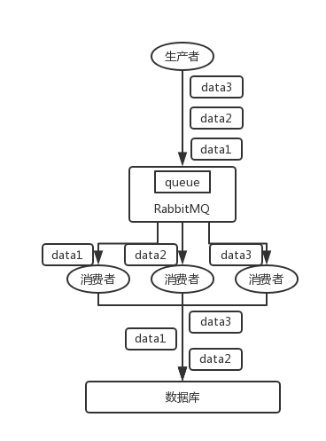
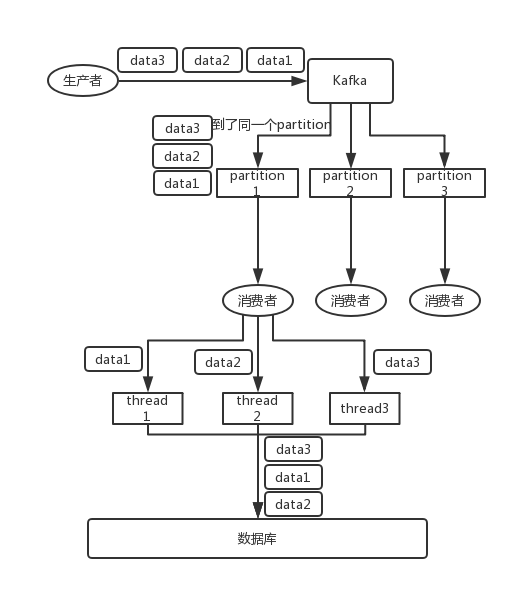

在分布式系统中，保证消息的顺序性是一个常见而重要的问题，尤其是在使用消息队列（Message Queue, MQ）时。以下是关于如何保证消息顺序性的详细解释，包括常见的消息队列（如 RabbitMQ 和 Kafka）在这方面的设计，以及我们可以采取的解决方案。

### 1. 消息顺序性的问题

消息顺序性的问题通常出现在以下场景中：
- 多个消费者同时消费消息队列中的消息，导致消息处理顺序与发送顺序不一致。
- 在分布式系统中，消息可能会被不同的消费者或线程处理，处理速度和顺序可能会不同。

### 2. RabbitMQ 顺序性问题及解决方案

#### 2.1 问题描述

在 RabbitMQ 中，一个 queue 可以有多个消费者。当多个消费者并发消费同一个 queue 时，消息的处理顺序可能会被打乱。例如，假设有三条消息 data1、data2 和 data3，顺序发送到 queue 中，三个消费者分别消费一条消息，可能会出现 data2 先被处理的情况。



#### 2.2 解决方案

- **每个 queue 只对应一个 consumer**：
  - **实现**：将一个 queue 绑定到一个消费者，从而确保消息的处理顺序。
  - **缺点**：吞吐量较低，因为单个消费者的处理能力有限。
  
  

- **使用内存队列和 worker 线程**：
  - **实现**：消息到达消费者后，根据某个关键字段（如订单 ID）进行哈希，将相同哈希值的消息放到同一个内存队列中。每个内存队列对应一个 worker 线程来处理消息。
  - **优点**：既保证了顺序性，又能通过多线程提高吞吐量。
  - **示意图**：
    ```plaintext
    RabbitMQ queue -> Consumer -> In-memory queues (based on hash) -> Worker threads
    ```

### 3. Kafka 顺序性问题及解决方案

#### 3.1 问题描述

在 Kafka 中，消息按照分区（partition）进行分布。每个分区内的消息是有序的，但如果消费者使用多个线程处理消息，消息的顺序可能会被打乱。



#### 3.2 解决方案

- **一个 topic，一个 partition，一个 consumer，单线程消费**：
  - **实现**：一个分区只由一个消费者以单线程的方式消费。
  - **缺点**：吞吐量低，不适用于高并发、高吞吐量的场景。

- **使用内存队列和多线程消费**：
  - **实现**：消息到达消费者后，根据消息的关键字段（如订单 ID）进行哈希，具有相同哈希值的消息放入同一个内存队列。每个内存队列由一个线程处理，从而保证消息的顺序性。
  - **优点**：能够并行处理消息，同时保证顺序性。
  - **示意图**：
    ```plaintext
    Kafka partition -> Consumer -> In-memory queues (based on hash) -> Worker threads
    ```

### 4. 实际案例分析

#### MySQL binlog 同步系统

考虑一个 MySQL binlog 同步系统，需要将一个 MySQL 数据库中的数据同步到另一个 MySQL 数据库。假设数据变更通过 binlog 发送到 MQ，然后由消费者处理：

- **问题**：如果多个消费者并行处理 binlog 日志，可能会导致数据操作顺序混乱。
- **解决方案**：
  - 使用内存队列和 worker 线程。
  - 每个 binlog 日志根据关键字段（如表名或主键）进行哈希，保证同一组数据变更被同一个 worker 线程处理。
  - 示例流程：
    ```plaintext
    MySQL binlog -> MQ -> Consumer -> In-memory queues (based on hash) -> Worker threads -> MySQL
    ```

### 5. 总结

保证消息顺序性的关键在于设计合适的消息处理机制，确保具有相同关键字段的消息按照顺序处理。通过合理利用内存队列和多线程，可以在提高处理吞吐量的同时，确保消息的顺序性。具体解决方案可以根据具体的业务场景和技术栈（如 RabbitMQ、Kafka 等）进行调整。