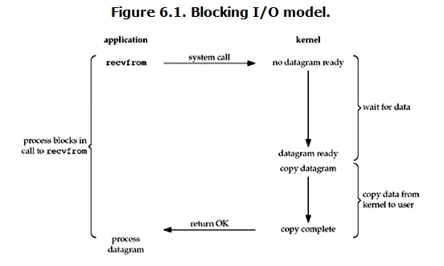

# I/O

## 基本概念

### 文件描述符fd

文件描述符（`File descriptor`）是计算机科学中的一个术语，是一个用于表述指向文件的引用的抽象化概念。

文件描述符在形式上是一个非负整数。实际上，它是一个索引值，指向内核为每一个进程所维护的该进程打开文件的记录表。当程序打开一个现有文件或者创建一个新文件时，内核向进程返回一个文件描述符。在程序设计中，一些涉及底层的程序编写往往会围绕着文件描述符展开。但是文件描述符这一概念往往只适用于 `UNIX、Linux` 这样的操作系统。

### 缓存 I/O

缓存 `I/O` 又被称作标准 `I/O`，大多数文件系统的默认 `I/O` 操作都是缓存 `I/O`。在 `Linux` 的`缓存 I/O` 机制中，操作系统会将 `I/O` 的数据缓存在文件系统的页缓存（ `page cache` ）中，也就是说，数据会先被拷贝到操作系统内核的缓冲区中，然后才会从操作系统内核的缓冲区拷贝到应用程序的地址空间。

缓存 I/O 的缺点：数据在传输过程中需要在应用程序地址空间和内核进行多次数据拷贝操作，这些数据拷贝操作所带来的 `CPU` 以及内存开销是非常大的。

## IO模式

刚才说了，对于一次IO访问（以read举例），数据会先被拷贝到操作系统内核的缓冲区中，然后才会从操作系统内核的缓冲区拷贝到应用程序的地址空间。所以说，当一个read操作发生时，它会经历两个阶段：
  1. 等待数据准备
  2. 将数据从内核拷贝到进程中

正式因为这两个阶段，Linux系统产生了下面五种网络模式的方案。
  - `阻塞 I/O`（blocking IO）
  - `非阻塞 I/O`（nonblocking IO）
  - `I/O 多路复用`（ IO multiplexing）
  - `信号驱动 I/O`（ signal driven IO）
  - `异步 I/O`（asynchronous IO）

> 由于signal driven IO在实际中并不常用，所以这里只提及剩下的四种 IO Model。

### 阻塞IO

在 `Linux` 中，默认情况下所有的 `socket` 都是 `blocking` ，一个典型的读操作流程大概是这样：



当用户进程调用了 `recvfrom` 这个系统调用， `kernel` 就开始了 IO 的第一个阶段：准备数据（对于网络IO来说，很多时候数据在一开始还没有到达。比如，还没有收到一个完整的 `UDP` 包。这个时候 `kernel` 就要等待足够的数据到来）。这个过程需要等待，也就是说数据被拷贝到操作系统内核的缓冲区中是需要一个过程的。而在用户进程这边，整个进程会被阻塞（当然，是进程自己选择的阻塞）。当 `kernel` 一直等到数据准备好了，它就会将数据从 `kernel` 中拷贝到用户内存，然后 `kernel` 返回结果，用户进程才解除 `block` 的状态，重新运行起来。

> blocking IO的特点就是在IO执行的两个阶段都被block了

### 非阻塞 I/O

`Linux` 下，可以通过设置 `socket` 使其变为 `non-blocking` 。当对一个 `non-blocking socket` 执行读操作时，流程是这个样子：


当用户进程发出 `read` 操作时，如果 `kernel` 中的数据还没有准备好，那么它并不会 `block` 用户进程，而是立刻返回一个 `error` 。从用户进程角度讲 ，它发起一个 `read` 操作后，并不需要等待，而是马上就得到了一个结果。用户进程判断结果是一个 `error` 时，它就知道数据还没有准备好，于是它可以再次发送 `read` 操作。一旦 `kernel` 中的数据准备好了，并且又再次收到了用户进程的 `system call` ，那么它马上就将数据拷贝到了用户内存，然后返回。

> nonblocking IO的特点是用户进程需要不断的主动询问kernel数据好了没有

### IO多路复用

IO多路复用就是我们说的 `select，poll，epoll` ，有些地方也称这种IO方式为 `event driven IO` 。`select/epoll` 的好处就在于单个 `process` 就可以同时处理多个网络连接的 IO 。它的基本原理就是 `select，poll，epoll` 这个 `function` 会不断的轮询所负责的所有 `socket` ，当某个 `socket` 有数据到达了，就通知用户进程。


**当用户进程调用了 select，那么整个进程会被 block**，而同时， `kernel` 会监视所有 `select` 负责的 `socket` ，当任何一个 `socket` 中的数据准备好了， `select` 就会返回。这个时候用户进程再调用 `read` 操作，将数据从 `kernel` 拷贝到用户进程。

> I/O 多路复用的特点是通过一种机制一个进程能同时等待多个文件描述符，而这些文件描述符（套接字描述符）其中的任意一个进入读就绪状态，`select()` 函数就可以返回。

这个图和 `blocking IO` 的图其实并没有太大的不同，事实上，还更差一些。因为这里需要使用两个 `system call` (`select` 和 `recvfrom`)，而 `blocking IO` 只调用了一个 `system call` (`recvfrom`)。但是，用 `select` 的优势在于它可以同时处理多个 `connection` 。

所以，**如果处理的连接数不是很高的话，使用 `select/epoll` 的 `web server` 不一定比使用 `multi-threading + blocking IO` 的 `web server` 性能更好，可能延迟还更大**。`select/epoll` 的优势并不是对于单个连接能处理得更快，而是在于能处理更多的连接。

在IO多路复用实际使用中，对于每一个socket，一般都设置成为 `non-blocking` ，但是，如上图所示，整个用户的 `process` 其实是一直被block的。只不过 `process` 是被 `select` 这个函数 `block` ，而不是被 `socket IO` 给 `block` 。

#### 基本概念

在 I/O 编程过程中,当需要同时处理多个客户端接入请求时，可以利用多线程或者 `I/O 多路复用` 技术进行处理。**`I/O多路复用` 技术通过把多个I/O的阻塞复用到同一个selct的阻塞上，从而使得系统在单线程的情况下可以同时处理多个客户端请求**。**与传统的 `多线程/多进程` 模型比，I/O多路复用的最大优势是系统开销小，系统不需要创建新的额外进程或者线程，也不需要维护这些进程和线程的运行，降低了系统的维护工作量，节省了系统资源**，I/O多路复用的主要应用场景如下。

  - 服务器需要同时处理多个处于监听状态或者多个连接状态的套接字
  - 服务器需要同时处理多种网络协议的套接字

目前支持I/O多路复用的系统调用有 `select、pselect、poll、epoll`，在Linux网络编程; 过程中，很长一段时间都使用 `select` 做轮询和网络事件通知，然而 `select` 的一些固有缺陷导致了它的应用受到了很大的限制。最终 `Linux` 不得不在新的内核版本中寻找 `select` 的替代方案，最终选择了 `epoll`。 `epoll` 与 `select` 的原理比较类似，为了克服 `select` 的缺点， `epoll` 作了很多重大改进，现总结如下。

##### 支持一个进程打开的 socket 描述符（FD）不受限制（仅受限于操作系统的最大文件句柄数）。

**`select` 最大的缺陷就是单个进程所打开的 FD 是有一定限制的**，它由 `FD_SETSIZE` 设置，默认值是 `1024` 。对于那些需要支持上万个 TCP 连接的大型服务器来说显然太少了。可以选择修改这个宏然后重新编译内核，不过这会带来网络效率的下降。我们也可以通过选择多进程的方案（传统的 Apache 方案）解决这个问题，不过虽然在 Linux上创建进程的代价比较小，但仍旧是不可忽视的，另外，进程间的数据交换非常麻烦，对于 Java 由于没有共享内存，需要通过 `Socket` 通信或者其他方式进行数据同步，这带来了额外的性能损耗，增加了程序复杂度，所以也不是一种完美的解决方案。值得庆幸的是， `epoll` 并没有这个限制，它所支持的 `FD` 上限是操作系统的 **最大文件句柄数**，这个数字远远大于 `1024` 。例如，在 `1 GB` 内存的机器上大约是 10万个句柄左右，具体的值可以通过`cat /proc/sys/fs/file- max` 察看，**通常情况下这个值跟系统的内存关系比较大**。

##### I/O效率不会随着FD数目的增加而线性下降。

传统的 `select/poll` 另-个致命弱点就是当你拥有一个很大的 `socket` 集合，由于网络延时或者链路空闲，任一时刻只有少部分的 `socket` 是“活跃”的，但是 **`select/poll` 每次调用都会线性扫描全部的集合，导致效率呈现线性下降**。 `epoll` 不存在这个问题，它只会对“活跃”的 `socket` 进行操作，这是因为在内核实现中 `epoll` 是根据每个 `fd` 上面的 `callback` 函数实现的，那么，只有“活跃”的 `socket` 才会主动的去调用 `callback` 函数，其他 `idle` 状态 `socket` 则不会。**在这点上， `epoll` 实现了一个伪 AIO**。针对 `epoll` 和 `select` 性能对比的 `benchmark` 测试表明：**如果所有的 `socket` 都处于活跃态，例如一个高速 `LAN` 环境， `epoll` 并不比 `select/poll` 效率高太多；相反，如果过多使用 `epoll_ ctl` , 效率相比还有稍微的下降。但是一旦使用 `idleconnections` 模拟 `WAN` 环境，`epoll` 的效率就远在 `select/poll` 之上了**。

##### 使用 mmap 加速内核与用户空间的消息传递

无论是 `select`，`poll` 还是 `epoll` 都需要内核把 FD 消息通知给用户空间，如何避免不必要的内存复制（Zero Copy）就显得非常重要， `epoll` 是通过内核和用户空间 `mmap` 共享同一块内存来实现。

##### Epoll 的 API 更加简单

包括创建一个 `epoll` 描述符、添加监听事件、阻塞等待所监听的事件发生，关闭 `epoll` 描述符等。

值得说明的是，用来克服 `select/poll` 缺点的方法不只有 `epoll` , `epoll` 只是一种 `Linux` 的 实现方案。在 `freeBSD` 下有 `kqueue`

### Epoll 边缘触发&水平触发

epoll 对文件描述符的操作有两种模式：LT（`level trigger`）和ET（`edge trigger`）。LT模式是 **默认模式** ，LT模式与ET模式的区别如下：

  - **LT模式**：当 epoll_wait 检测到描述符事件发生并将此事件通知应用程序，应用程序可以不立即处理该事件。下次调用 epoll_wait 时，会再次响应应用程序并通知此事件。
  - **ET模式**：当 epoll_wait 检测到描述符事件发生并将此事件通知应用程序，应用程序必须立即处理该事件。如果不处理，下次调用 epoll_wait 时，不会再次响应应用程序并通知此事件。

> ET模式 在很大程度上减少了 epoll 事件被重复触发的次数，因此 **效率要比LT模式高**。epoll 工作在ET模式的时候，**必须使用非阻塞套接口**，以避免由于一个文件句柄的阻塞读/阻塞写操作把处理多个文件描述符的任务饿死。

## 异步 I/O


用户进程发起 `read` 操作之后，立刻就可以开始去做其它的事。而另一方面，从 `kernel` 的角度，当它受到一个 `asynchronous read` 之后，首先它会立刻返回，所以不会对用户进程产生任何 `block` 。然后，`kernel` 会等待数据准备完成，然后将数据拷贝到用户内存，当这一切都完成之后，`kernel` 会给用户进程发送一个 `signal` ，告诉它 `read` 操作完成了。

## blocking vs non-blocking

调用 `blocking IO` 会一直 `block` 住对应的进程直到操作完成，而 `non-blocking IO` 在 `kernel` 还准备数据的情况下会立刻返回。

## synchronous IO vs asynchronous IO
在说明`synchronous IO`和`asynchronous IO`的区别之前，需要先给出两者的定义。 `POSIX` 的定义是这样子的：

  - A synchronous I/O operation causes the requesting process to be blocked until that I/O operation completes;
  - An asynchronous I/O operation does not cause the requesting process to be blocked;

两者的区别就在于 `synchronous IO` 做 `IO operation` 的时候会将 `process` 阻塞。按照这个定义，之前所述的 `blocking IO，non-blocking IO，IO multiplexing` 都属于 `synchronous IO`。

有人会说，`non-blocking IO` 并没有被 `block` 啊。这里有个非常 **狡猾** 的地方，定义中所指的 `IO operation` 是指真实的 IO 操作，就是例子中的 `recvfrom` 这个 `system call` 。`non-blocking IO` 在执行 `recvfrom` 这个 `system call` 的时候，如果 `kernel` 的数据没有准备好，这时候不会 `block` 进程。但是，当 `kernel` 中数据准备好的时候，`recvfrom` 会将数据从 `kernel` 拷贝到用户内存中，这个时候进程是被 `block` 了，在这段时间内，进程是被 `block` 的。

而 `asynchronous IO` 则不一样，当进程发起 `IO` 操作之后，就直接返回再也不理睬了，直到 `kernel` 发送一个信号，告诉进程说IO完成。在这整个过程中，进程完全没有被 `block` 。

## 参考

  - [Linux IO模式及 select、poll、epoll详解](https://segmentfault.com/a/1190000003063859)

-------

## I/O硬件原理

### I/O系统

通常把I/O设备及其接口线路、控制部件、通道和管理软件称为I/O系统，把计算机的内存和设备介质之间的信息传送操作称为I/O操作。可按照不同方式对设备进行分类：按I/O操作特性分为输入型设备、输出型设备和存储型设备；按I/O信息交换单位分为字符设备和块设备。

> 输入、输出型设备通常是字符设备，存储型设备通常是块设备。

存储型设备又分为顺序存储设备和直接存取设备。前者严格依赖信息的物理位置进行读写和定位，如磁带。后者的特点是存取任何一个物理块所需要的时间几乎不依赖于此信息所处的位置，如磁盘。

### I/O控制方式

#### 轮询方式

轮询方式又称程序直接控制方式，使用查询指令测试设备控制器的忙闲状态位，确定内存和设备是否能交换数据。轮询方式采用三条指令：查询指令，查询设备是否就绪；读写指令，当设备就绪时执行数据交换；转移指令，当设备未就绪时执行转移指令指向查询指令继续查询。可见，在这种方式下CPU和设备只能串行工作。

#### 中断方式

在这种方式下CPU和设备之间传输数据的过程如下：

  1. 进程发出启动I/O指令，CPU加载控制信息到设备控制器的寄存器，然后进程继续执行不涉及本次I/O数据的任务，或放弃CPU等待设备I/O操作完成。

  2. 设备控制器检查寄存器的内容，按照I/O指令的要求执行相应I/O操作，一旦传输完成，设备控制器发出I/O中断请求信号。

  3. CPU收到并响应I/O中断后，转向设备的I/O中断处理程序执行。

  4. 中断处理程序执行数据读取操作，将I/O缓冲寄存器的内容写入内存，操作结束后退出中断处理程序，返回发生中断前的状态。

  5. 进程调度程序在适当的时候让得到数据的进程恢复执行。

在I/O中断方式中，如果设备控制器的数据缓冲区较小，当缓冲器装满后便会发生中断，那么在数据传输过程中发生中断次数会很多，这样就消耗了大量CPU时间。

#### DMA方式

虽然中断方式提高了CPU利用率，但是在响应中断请求后必须停止现行程序，转入中断处理程序并参与数据传输操作。在`DMA(Direct Memory Access)`方式中，内存和设备之间有一条数据通路成块地传送数据，无须CPU干预，实际数据传输操作由DMA直接完成。为实现DMA，至少需要以下逻辑部件：

  1. 内存地址寄存器：存放内存中需要交换数据的地址，DMA传送之前由程序送入首地址；DMA传送过程中，每次交换数据都把地址寄存器的内容加1。

  2. 字计数器：记录传送数据的总字数，每次传送一个字就把字计数器减1。

  3. 数据缓冲寄存器或数据缓冲区：暂存每次传送的数据。

  4. 设备地址寄存器：存放I/O信息的地址，如磁盘的柱面号。

  5. 中断机制和控制逻辑：用于向CPU提出I/O中断请求及CPU发来的I/O命令，管理DMA的传送过程。

#### 通道方式

通道又称I/O处理器，能完成内存和设备之间的信息传送，与CPU并行地执行操作。采用I/O通道设计后，I/O操作过程如下：CPU在执行主程序时遇到I/O请求，启动在指定通道上选址的设备，一旦启动成功，通道开始控制设备进行操作，这时CPU就可以执行其他任务并与通道并行工作，直到I/O操作完成；当通道发出I/O操作结束中断时，处理器才响应并停止当前工作，转向I/O操作结束事件。

# 磁盘与文件

## 磁盘

磁盘是可以持久存储的设备，根据存储介质的不同，常见磁盘可以分为两类：机械磁盘和固态磁盘

**机械磁盘**，也称为硬盘驱动器，通常缩写为HDD。机械磁盘主要有盘片和读写磁头组成，数据就存储在盘片的环状磁道中。在读写数据前，需要移动读写磁头，定位到数据所在的磁道，然后才能访问数据。最小读写单位是 **扇区** ，一般大小为512字节。

**固态磁盘**，通常缩写为SSD，有固态电子元器件组成。固态磁盘不需要磁道寻址，所以，不管是连续I/O还是随机I/O的性能，都比机械磁盘要好得多。

**连续 I/O 还可以通过预读的方式，来减少I/O请求的次数**，这也是其性能优异的一个原因。很多性能优化的方案，也都会从这个角度出发，来优化I/O性能。最小读写单位是 页，通常大小是 4KB ，8KB 等。


### 磁盘调度

磁盘访问延迟 = 队列时间 + 控制器时间 + 寻道时间 + 旋转时间 + 传输时间

磁盘调度的目的是减小延迟，其中前两项可以忽略，寻道时间是主要矛盾。

### 磁盘调度算法

  - `FCFS`：先进先出的调度策略，这个策略具有公平的优点，因为每个请求都会得到处理，并且是按照接收到的顺序进行处理。

  - `SSTF(Shortest-seek-time First 最短寻道时间优先)`：选择使磁头从当前位置开始移动最少的磁盘I/O请求，所以 SSTF 总是选择导致最小寻道时间的请求。总是选择最小寻找时间并不能保证平均寻找时间最小，但是能提供比 FCFS 算法更好的性能，会存在饥饿现象（会导致较远的I/O请求不能满足）。

  - `SCAN`：SSTF+中途不回折，每个请求都有处理机会。SCAN 要求磁头仅仅沿一个方向移动，并在途中满足所有未完成的请求，直到它到达这个方向上的最后一个磁道，或者在这个方向上没有其他请求为止。由于磁头移动规律与电梯运行相似，SCAN 也被称为`电梯算法`。

  > SCAN 算法对最近扫描过的区域不公平，因此，它在访问局部性方面不如 FCFS 算法和 SSTF 算法好。

  - `C-SCAN`：SCAN+直接移到另一端，两端请求都能很快处理。把扫描限定在一个方向，当访问到某个方向的最后一个磁道时，磁道返回磁盘相反方向磁道的末端，并再次开始扫描。其中“C”是Circular（环）的意思。

  - `LOOK(C-LOOK)`：釆用SCAN算法和C-SCAN算法时磁头总是严格地遵循从盘面的一端到另一端，显然，在实际使用时还可以改进，**即磁头移动只需要到达最远端的一个请求即可返回，不需要到达磁盘端点**。这种形式的SCAN算法和C-SCAN算法称为LOOK和C-LOOK调度。这是因为它们在朝一个给定方向移动前会查看是否有请求。

## 文件系统

文件系统是对存储设备上的文件，进行组织管理的一种机制。而 Linux 在各种文件系统实现上，抽象了一层虚拟文件系统 VFS ，它定义了一组，所有文件系统都支持的，数据结构和标准接口。VFS 内部通过目录项，索引节点，逻辑块以及超级块等数据结构，来管理文件。

- 目录项：记录了文件的名字，以及文件与其他目录项之间的目录关系。
- 索引节点：记录了文件的元数据
- 逻辑块：是由连续磁盘扇区构成的最小读写单元，用来存储文件系统
- 超级块：用来记录文件系统整体的状态，如索引节点和逻辑块的使用情况等。

其中，目录项是一个内存缓存；而超级块，索引节点和逻辑块，都是存储在磁盘中的持久数据。

如果每次都读写 512 字节这么小的单位的话，效率很低。所以，文件系统会把连续的扇区或页，组成逻辑块，然后以逻辑块作为最小单元来管理数据。常见的逻辑块的大小是 4KB ，也就是连续8个扇区，或者单独的一个页，都可以组成一个逻辑块。

### 通用块层

为了减小不同块设备的差异带来的影响，Linux 通过一个统一的通用块层，来管理各种不同的块设备。 通用块层，其实是处在文件系统和磁盘驱动中间的一个块设备抽象层。它主要有两个功能：

- 同虚拟文件系统的功能类似：向上，为文件系统和应用程序，提供访问块设备的标准接口；向下，把各种异构的磁盘设备抽象为统一的块设备，并提供统一框架来管理这些设备的驱动程序。
- I/O调度：对文件系统和应用程序发来的I/O请求排队，并通过重新排序，请求合并等方式，提高磁盘读写的效率。Linux 内核支持四种 I/O 调度算法，分别是 NONE , NOOP , CFQ 以及 DeadLine

### IO 栈

可以把 Linux 存储系统的I/O栈，由上到下分为三个层次，分别是文件系统层，通用块层和设备层。


- **文件系统层**：包括虚拟文件系统和其他各种文件系统的具体实现。它为上层的应用程序，提供标准的文件访问接口；对下会通过调用块层，来存储和管理磁盘数据。
- **调用块层**：包扣块设备I/O队列和I/O调度器。它会对文件系统的I/O请求进行排队，再通过重新排序和请求合并，然后才要发送给下一级的设备层。
- **设备层**：包扣存储设备和相应的驱动程序，负责最终物理设备的I/O操作。


## Linux文件权限

Linux文件采用10个标志位来表示文件权限，如下所示：

```
-rw-r--r--  1 skyline  staff    20B  1 27 10:34 1.txt
drwxr-xr-x   5 skyline  staff   170B 12 23 19:01 ABTableViewCell
```

第一个字符一般用来区分文件和目录，其中：

  - d：表示是一个目录，事实上在ext2fs中，目录是一个特殊的文件。
  - －：表示这是一个普通的文件。
  - l: 表示这是一个符号链接文件，实际上它指向另一个文件。
  - b、c：分别表示区块设备和其他的外围设备，是特殊类型的文件。
  - s、p：这些文件关系到系统的数据结构和管道，通常很少见到。

第2～10个字符当中的每3个为一组，左边三个字符表示所有者权限，中间3个字符表示与所有者同一组的用户的权限，右边3个字符是其他用户的权限。

这三个一组共9个字符，代表的意义如下：

  - r(Read，读取)：对文件而言，具有读取文件内容的权限；对目录来说，具有浏览目录的权限
  - w(Write,写入)：对文件而言，具有新增、修改文件内容的权限；对目录来说，具有删除、移动目录内文件的权限。
  - x(eXecute，执行)：对文件而言，具有执行文件的权限；对目录来说该用户具有进入目录的权限。

权限的掩码可以使用十进制数字表示：

  - 如果可读，权限是二进制的100，十进制是4；
  - 如果可写，权限是二进制的010，十进制是2；
  - 如果可运行，权限是二进制的001，十进制是1；

### chmod命令

chmod命令非常重要，用于改变文件或目录的访问权限。用户用它控制文件或目录的访问权限。

该命令有两种用法。一种是包含字母和操作符表达式的文字设定法；另一种是包含数字的数字设定法。

1. 文字设定法

  chmod ［who］ ［+ | - | =］ ［mode］ 文件名

  命令中各选项的含义为：

  操作对象who可是下述字母中的任一个或者它们的组合：

  * u 表示“用户（user）”，即文件或目录的所有者。
  * g 表示“同组（group）用户”，即与文件属主有相同组ID的所有用户。
  * o 表示“其他（others）用户”。
  * a 表示“所有（all）用户”。它是系统默认值。

  操作符号可以是：

  * + 添加某个权限。
  * - 取消某个权限。
  * = 赋予给定权限并取消其他所有权限（如果有的话）。


  设置mode所表示的权限可用下述字母的任意组合：

  * r 可读。
  * w 可写。
  * x 可执行。
  * X 只有目标文件对某些用户是可执行的或该目标文件是目录时才追加x 属性。
  * s 在文件执行时把进程的属主或组ID置为该文件的文件属主。方式“u＋s”设置文件的用户ID位，“g＋s”设置组ID位。
  * t 保存程序的文本到交换设备上。
  * u 与文件属主拥有一样的权限。
  * g 与和文件属主同组的用户拥有一样的权限。
  * o 与其他用户拥有一样的权限。

  文件名：以空格分开的要改变权限的文件列表，支持通配符。

  在一个命令行中可给出多个权限方式，其间用逗号隔开。例如：`chmod g+r，o+r example` 使同组和其他用户对文件example 有读权限。

2. 数字设定法

  直接使用数字表示的权限来更改：

  ```
  例： $ chmod 644 mm.txt
  ```


### chgrp命令

功能：改变文件或目录所属的组。

语法：chgrp ［选项］ group filename

```
例：$ chgrp - R book /opt/local /book
```

改变/opt/local /book/及其子目录下的所有文件的属组为book。

### chown命令

功能：更改某个文件或目录的属主和属组。这个命令也很常用。例如root用户把自己的一个文件拷贝给用户xu，为了让用户xu能够存取这个文件，root用户应该把这个文件的属主设为xu，否则，用户xu无法存取这个文件。

语法：chown ［选项］ 用户或组 文件

说明：chown将指定文件的拥有者改为指定的用户或组。用户可以是用户名或用户ID。组可以是组名或组ID。文件是以空格分开的要改变权限的文件列表，支持通配符。

```
例：把文件shiyan.c的所有者改为wang。

    chown wang shiyan.c
```